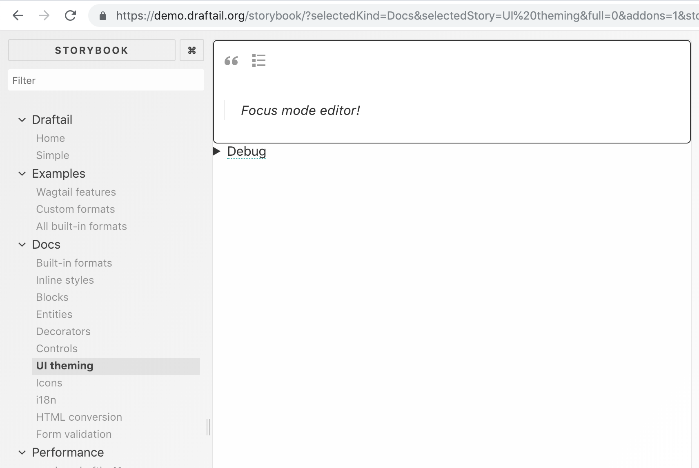

It’s been a while since the last Draftail release! [Draftail v1.1.0](https://www.npmjs.com/package/draftail) is out; the [CHANGELOG](https://github.com/springload/draftail/blob/main/CHANGELOG.md#v110) is fairly short but I thought it would also be good to report on what’s been happening behind the scenes.

<!-- truncate -->

## Bug fixes and new features

This release comes with a new feature – support for [form validation](/docs/form-validation) (and more), with [`onFocus`](/docs/api#managing-focus) and [`onBlur`](/docs/api#managing-focus) props for the editor. Thanks to [@TheSpicyMeatball](https://github.com/TheSpicyMeatball) for making this happen.

It also comes with many bug fixes:

- Stop unnecessarily calling `onSave` in the editor’s `onBlur` ([#173](https://github.com/springload/draftail/issues/173)).
- Prevent crash when filtering pasted content whose last block is to be removed (e.g. unsupported image) ([#179](https://github.com/springload/draftail/issues/179)).
- Prevent crash in `DraftUtils.getEntitySelection`, when the provided entity key isn't valid (undefined, missing) ([#168](https://github.com/springload/draftail/pull/168))
- Fix entity removal and editing not doing anything when the selection is backwards (right to left) ([#168](https://github.com/springload/draftail/pull/168)).

None of those bugs were that critical, but I’m particularly happy to see them addressed because the reports came from users of Draftail I didn’t know about. Draftail was originally developped for [Wagtail](https://wagtail.org/), but we spent a great deal of effort to make sure it would be usable (and good!) outside of the CMS as well. It’s good to see others using the editor, and contribute to its maintenance.

## Maintenance improvements

The last major feature changes in Draftail happened nearly a year ago – [v0.17.0](https://github.com/springload/draftail/compare/v0.17.0...main), with two subsequent patch releases, which graduated to v1.0.0. This is a long time in the current JavaScript landscape, and part of the reason for this was that I was really concerned with adding features onto a project where stability is paramount. Via Wagtail, Draftail is used on hundreds (thousands?) of websites, and we definitely want to minimise breakage when making changes.

To help with this, I worked on a number of much needed behind-the-scenes improvements to Draftail as a project:

- Integrating [Danger](https://github.com/danger/danger-js) onto the project, an automation tool to vet pull requests.

> Danger helps enforcing the parts of the software development process that are not automated: keeping the documentation up to date, making sure new code comes with tests, assessing new dependencies added onto a project, etc.

- Splitting Draftail’s most important overrides of Draft.js into separate packages, [draftjs-filters](https://github.com/thibaudcolas/draftjs-filters) and [draftjs-conductor](https://github.com/thibaudcolas/draftjs-conductor), so others could use the improvements, and help with the maintenance. Combined, those two packages get **20x** the downloads of Draftail.
- Adding [stylelint](https://stylelint.io/) to lint styles ([#126](https://github.com/springload/draftail/issues/126)), with my custom [styleling-config-cookbook](https://github.com/thibaudcolas/stylelint-config-cookbook) configuration. CSS being a very permissive language, I find it especially important to have strict checks there.
- Upgrading ESLint and the config (now [eslint-plugin-cookbook](https://github.com/thibaudcolas/eslint-plugin-cookbook)). Here as well, JavaScript being so permissive, it’s important for the project’s health to have strict checks.
- Did I mention something about languages being too permissive? Well, the editor now also uses [Flow](https://flow.org/) types ([#127](https://github.com/springload/draftail/issues/127)) to keep JS under check. This actually already helped surface some of the bugs fixed in this release, as well as potential sources of crashes in the editor, so thank you Flow!
- I also added performance tests (memory, CPU), to be able to benchmark future additions to the editor.

Last but not least, Draftail also has new documentation and demos!

### New documentation and demos

The Draftail documentation used to consist of a very long README, which kept things simple, but also very (very) short. Now, everything lives at [draftail.org](https://www.draftail.org/), a brand new website built with [Docusaurus](https://docusaurus.io/)!

Building a full-fledged documentation website is obviously more work than a README, but it comes with many advantages:

- It’s easier to navigate around bigger documentations. To me, good, extensive documentation is one of the hallmarks of great software.
- Because of the ease of navigation, docs can be redundant – e.g. cover the same topic with an intro, a full-fledged guide, and an API reference.
- Docs can be versioned. READMEs are versioned too, but people often do not realise they can use GitHub’s branch/tags navigation for this.
- Search! draftail.org’s is built with [Algolia DocSearch](https://community.algolia.com/docsearch/).

Finally, the last thing I love about this new documentation is that it can contain live examples of the editor in iframes.

### New examples with Storybook

As part of [Hacktoberfest 2018](https://hacktoberfest.digitalocean.com/), the examples / demo / playground site for Draftail was rebuilt with [Storybook](https://storybook.js.org/) ([#163](https://github.com/springload/draftail/issues/163)).

> Demo of the editor’s theming capabilities. The left-hand menu lists all of the demos/stories.

Here as well, compared to the previous two-page site, this has made it possible for me to build (and keep organised) many more examples, as well as having separate self-contained examples for all of the parts of the API. Storybook also happens to be a great development environment, with great hot reloading capabilities and custom UI panels to help with development.

## Up next

I’m really happy with how easy to maintain the editor is because of all of those changes. It’s easy to be confident in code changes because of the extensive linting and tests. The ease of changing documentation and creating new demos makes it easy to support people trying to solve specific problems with the editor. More than anything, I’m happy that the new documentation makes it easier for people outside of the Wagtail world to use the editor. Now, onto new features!

I have been working on making Draftail [compatible with the draft-js-plugins architecture](https://github.com/springload/draftail/pull/171) thanks to the support I receive on [Patreon](https://www.patreon.com/thibaud_colas), and this is very close to being ready. This will effectively make it possible to build much more advanced extensions to the editor, without reinventing too many APIs. This is very exciting (at least to me!) because it will make it possible to experiment much more with the editor’s features without compromising its stability. I’m particularly keen to add new means of interacting with content:

- Smarter copy-paste support ([#62](https://github.com/springload/draftail/issues/62)) – paste a YouTube link into the editor, get an embed block right away
- Drag and drop support ([#117](https://github.com/springload/draftail/issues/117)) – drop an image, get it as a block
- Better custom blocks ([#158](https://github.com/springload/draftail/issues/158)) – that can easily be selected, edited, moved around
- New toolbars ([#64](https://github.com/springload/draftail/issues/64)) – to reduce the visual footprint of the editor UI
- Autocompletes and slash-commands – as fast as keyboard shortcuts, but with better discoverability, and easier extensibility

---

If you want to keep track of how this is all coming along, have a look at the WIP [draft-js-plugins compatibility pull request](https://github.com/springload/draftail/pull/171), and come chat in the [#draftail](https://github.com/wagtail/wagtail/wiki/Slack) Slack channel.
