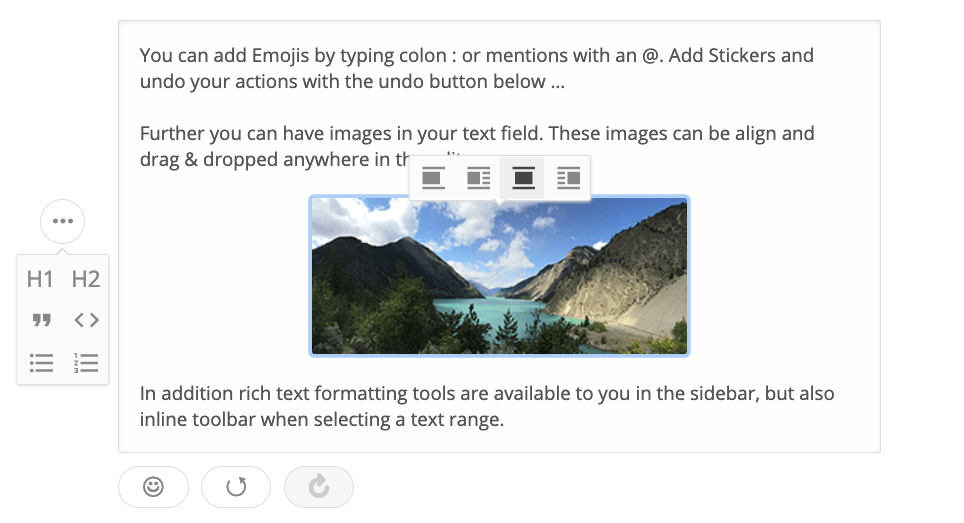
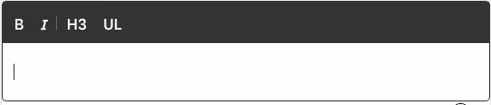

Draftail [v1.2.0](https://github.com/springload/draftail/blob/main/CHANGELOG.md#v120) is out, and it packs a punch. While the [previous release](/blog/2019/02/08/draftail-v1-1-0-a-quality-of-life-release) focused on maintainability and bug fixes, this time around it's all about shiny new features: support for the [Draft.js Plugins](https://www.draft-js-plugins.com/) architecture and its plugin ecosystem, and new ways to format content with Markdown shortcuts.

<!-- truncate -->

## Draft.js Plugins support

Draftail now supports [Draft.js Plugins](https://www.draft-js-plugins.com/), a set of high-quality plugins for Draft.js editors, and a pluggable architecture to write advanced extensions for Draftail.

While the set of existing plugins is already pretty impressive in its own right, the architecture is even more important: it makes it possible for third-party developers to customise most if not all of the behavior of the editor – from the rendering of any block, to the text input handling, keyboard shortcuts, copy-paste handling, and more. **Anything that is customisable in a bespoke Draft.js implementation should now be customisable in Draftail.**

> All of these rich text features are built with plugins. See any you’d like to use?

For the future of Draftail, it will make it much easier to experiment with new rich text interactions without compromising on the editor’s stability. Building upon an existing ecosystem of plugins will also increase the reusability of Draft.js extensions, and ease maintenance.

### Tradeoffs

The obvious tradeoff in introducing support for Draft.js Plugins is the performance cost of a plugin architecture on top of Draft.js. It's actually fairly minimal: for loading performance, the core of Draft.js Plugins (`draft-js-plugins-editor`) is relatively small: [about 4kB gzipped](https://bundlephobia.com/result?p=draft-js-plugins-editor). For rendering performance / responsivity of the editor, Draft.js is pretty good at limiting re-rendering and computations to only the subset of the editor that’s being edited. This makes the performance overhead relatively small as long as the plugins perform normally.

The other tradeoff is in preserving the content filtering capabilities that make Draftail good: being able to trust the editor to filter out unsupported content, and only keep what is allowlisted. Here, the plugins come with a catch: since the architecture doesn’t support allowlisting supported content, types of formatting that can be introduced by plugins will need to be registered with the editor’s existing [APIs for content formats](/docs/formatting-options).

### Opportunities

The biggest opportunity is in being able to introduce new means of interaction with the editor, that will make it better for end users. My favourite example of this is a simple [“linkify” feature](/docs/extensions-tutorial-linkify):

See how easy it was to add that link? No need to reach out for the mouse to use the toolbar’s link picker, or know the keyboard shortcut – paste the link where it’s meant to be and it just works. This is the type of interaction that’s easy to iterate on when the editor comes with APIs that support these (here, the [`handlePastedText`](https://draftjs.org/docs/api-reference-editor#handlepastedtext) API from Draft.js).

---

Here’s another example, this time with embeds:

Here, typing `/embed` followed by an embed URL and pressing return is enough for an embed block to appear. No need for a modal to appear with a “URL” field to paste our link in, the editor’s API allow us to do this directly within the content. The added benefit is in discoverability of the editor’s features: it would be pretty simple to have an autocomplete on those commands, and support many more features than it would be realistic to have in a toolbar, or as keyboard shortcuts.

Again, experimenting with this new type of interaction pattern is made possible by the new APIs that come with the plugin architecture (here, [`handleReturn`](https://draftjs.org/docs/api-reference-editor#handlereturn)).

---

Here are examples of feature requests to Draftail that can now be implemented as extensions, thanks to the new APIs:

- [#62 – Add "linkify" feature](https://github.com/springload/draftail/issues/62)
- [#64 – Add editor UI with Medium-style controls](https://github.com/springload/draftail/issues/64)
- [#113 – Add character replacements for typing convenience & typographic correctness](https://github.com/springload/draftail/issues/113)
- [#118 – Add support for emojis](https://github.com/springload/draftail/issues/118)
- [#158 – Support atomic blocks (images, embeds, hr, etc) without wrapper text blocks](https://github.com/springload/draftail/issues/158)
- [#169 – Support advanced customisations to block rendering](https://github.com/springload/draftail/issues/169)

## Markdown shortcuts for inline styles

The editor now supports using Markdown shortcuts for inline styles: bold, italic, strikethrough, and code.

Have a look at the [keyboard shortcuts](/docs/keyboard-shortcuts) to see what’s supported.

---

Now I’m excited to see what people will be building with those new APIs! Please come by the [#draftail](https://github.com/wagtail/wagtail/wiki/Slack) Slack channel if you need any help, or don’t hesitate to [participate in the Draftail issue tracker](https://github.com/springload/draftail).
