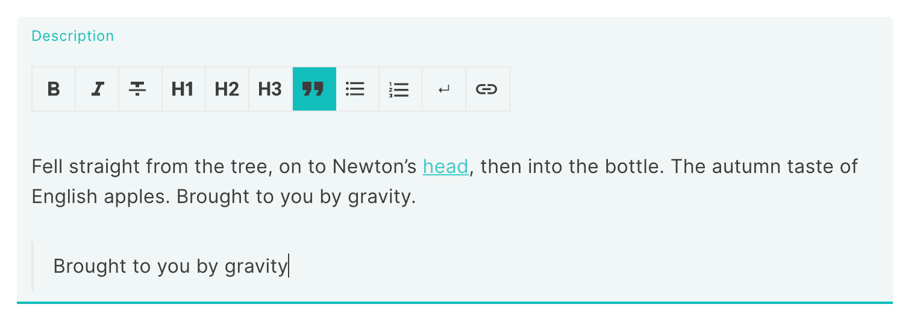

Time for a new release! Draftail [v1.3.0](https://github.com/springload/draftail/blob/main/CHANGELOG.md#v130) is out, and this is the first release to solely focus on improvements or fixes requested by users of Draftail outside of Wagtail, its first large-scale implementation.

<!-- truncate -->

## Bug fixes and new features

### readOnly editor support

The editor now supports being set to [`readOnly`](/docs/api#draftaileditor) mode, just like vanilla Draft.js. Thanks to [@SpearThruster](https://github.com/SpearThruster) for requesting this, _and_ making the pull request to implement this new prop for the editor 🎉.

### Controlled editor

Another commonly requested feature was for using the editor as a [controlled component](https://reactjs.org/docs/forms.html#controlled-components) – the recommended mode of operation for form elements in React, and again how vanilla Draft.js works.

This is now implemented with two props: [`editorState` and `onChange`](/docs/api#editorstate-and-onchange). People familiar with vanilla Draft.js will feel right at home. This will also make it much easier to integrate the editor in apps where state is centrally managed, or where forms have specific reset / validation behavior.

To help with Draft.js state initialisation and persistence, Draftail now also exposes APIs to help with [data conversion](/docs/controlled-component#data-conversion-helpers), which are built-in with the uncontrolled editor API.

### Customisable undo/redo button icons

Thanks to [@rmakovyak](https://github.com/rmakovyak) for fixing this – icons should be [customisable in the toolbar](/docs/customising-icons) for all buttons, but there was a bug preventing this for undo/redo buttons via the `showUndoControl` and `showRedoControl` props.

## State of Draftail

Put simply, none of the above changes are going to be useful for Draftail’s first use case: as an editor for [Wagtail](https://wagtail.org). I find this wonderful: this reflects that the editor is beneficial for people outside of the Wagtail bubble, and, with those changes, it will become useful for even more use cases that I didn’t initially identify.

According to GitHub and npm statistics, the editor is used in [118 public repositories](https://github.com/springload/draftail/network/dependents) and gets downloaded [1’772 times per week on npm](https://www.npmjs.com/package/draftail). There are well known names in there – the [FEC](https://github.com/fecgov/fec-cms) in the US for their CMS, [NATO’s Communication and Information Agency](https://github.com/NCI-Agency/anet), [Sciences Po’s médialab](https://medialab.sciencespo.fr). [Saleor](https://getsaleor.com/), an up-and-coming e-commerce platform built on modern technologies also [announced on their blog](https://medium.com/saleor/february-release-of-saleor-three-new-dashboard-2-0-sections-6d775479882e) that the upcoming version of Saleor would be using Draftail for rich text content.

> Draftail looking good in Saleor dashboard 2.0!

I’m sure there are many more. If you’re using Draftail, please do [get in touch](https://github.com/thibaudcolas/draftail.org/issues/13) so others can see all of the cool things you’re doing with it!

### Up next

With those improvements in place to make Draftail usable in more scenarios, I’d really like to go back to focusing on features again. Here are things that look really cool that I’d like to look at next:

- [Table support #198](https://github.com/springload/draftail/issues/198). This is lots of work, but would be really cool to have basic support out of the box or as an "official" extension.
- [Support image blocks without wrapper text blocks #158](https://github.com/springload/draftail/issues/158) – and generally better built-in support for images, most likely as an "official" extension with good defaults.
- [Add character replacements for typing convenience & typographic correctness #113](https://github.com/springload/draftail/issues/113). This is one of those little things that make an editor much more pleasant to use, if done well.
- [Add support for emojis #118](https://github.com/springload/draftail/issues/118). I’d really like to nail this one!
