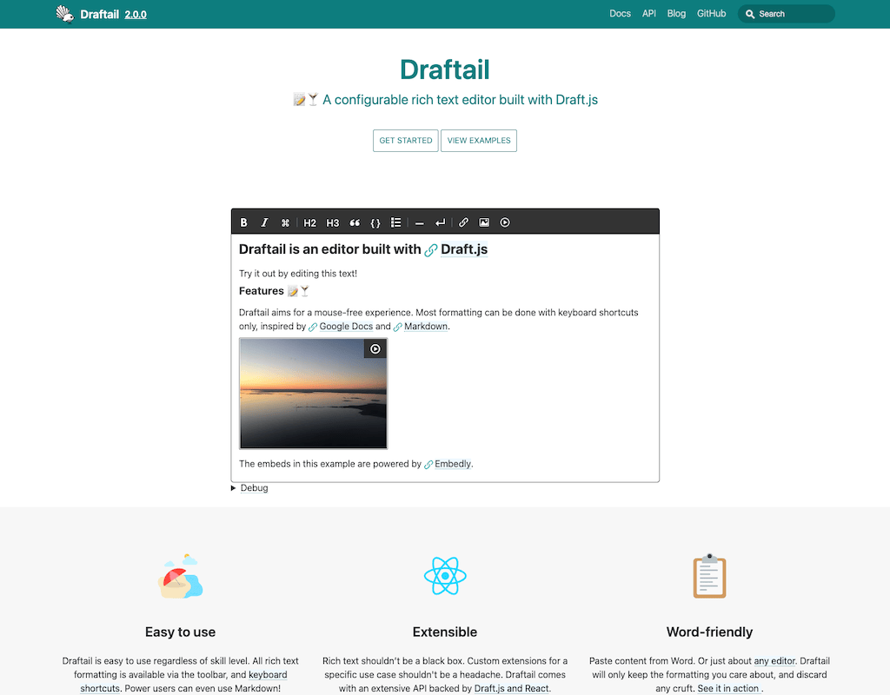

With design updates, fancy new features ✨, and opportunities for further improvements.

<!-- truncate -->

This site’s design and implementation have been more or less the same in 7 years! I thought it was time for an upgrade.

## The 2018 website

I decided to set up a standalone docs site for Draftail back in October 2018, and set up the site with [Docusaurus](https://docusaurus.io/) v1. I think it looks pretty good:

I chose Docusaurus because I really like building web content as well as as apps with React ergonomics, and Docusaurus is just the right combination of opinionated defaults for this, geared towards fully static sites. No server but also little to no need for client-side JavaScript. Most of this site’s setup was copied from [Draft.js website](https://draftjs.org/).

I also really liked how compared to other docs website generators, there was a clear blogging component. I wish more technical docs included a bit of blogging. It’s nice for releases announcements but also for other aspects of the project!

## Why the upgrade

The biggest drawback with the 2018 site was accessibility issues, which weren’t possible to resolve within the opinionated Docusaurus v1 setup without extensive overrides, otherwise it could have been deemed good enough in perpetuity - I didn’t see big reason to chase updates. In addition, I’ve also wanted to trial a few improvements to the site, and it feels better to experiment within a fresher setup!

I briefly considered alternatives like [VitePress](https://vitepress.dev/) and [Starlight](https://starlight.astro.build/). They’re nice and shiny, seem to provide similar ergonomics, but not be opinionated enough. It would require plugins and custom development to get the features I’m after:

- Blogging. Certainly something I don’t want to reinvent.
-

## Future features

[llms.txt](https://llmstxt.org/)

[Ask AI](https://docsearch.algolia.com/docs/v4/askai/) with [OpenRouter](https://openrouter.ai/)

SEO https://docusaurus.io/docs/seo

https://docsearch.algolia.com/ issues indexing

[NLWeb](https://github.com/nlweb-ai/NLWeb)

[HUD in Netlify](https://docs.netlify.com/deploy/review-deploys/heads-up-display/)

Dark theme

Multilingual content

https://pagespeed.web.dev/analysis/https-www-draftail-org-docs-api/rfwgitxncz?form_factor=mobile

https://pagespeed.web.dev/analysis/https-69172eea3b977200082d7b3b--draftail-netlify-app-docs-api/27t1cexryr?form_factor=mobile

https://69172eea3b977200082d7b3b--draftail.netlify.app/docs/api

https://angular.dev/ai
https://docs.modular.com/max/coding-assistants/
